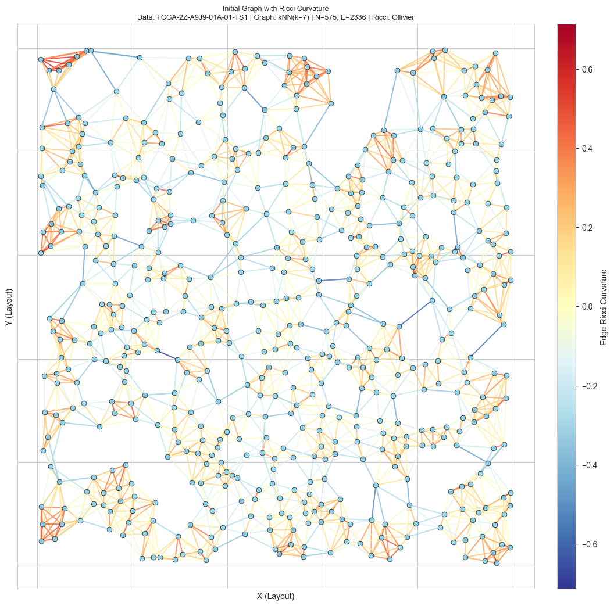
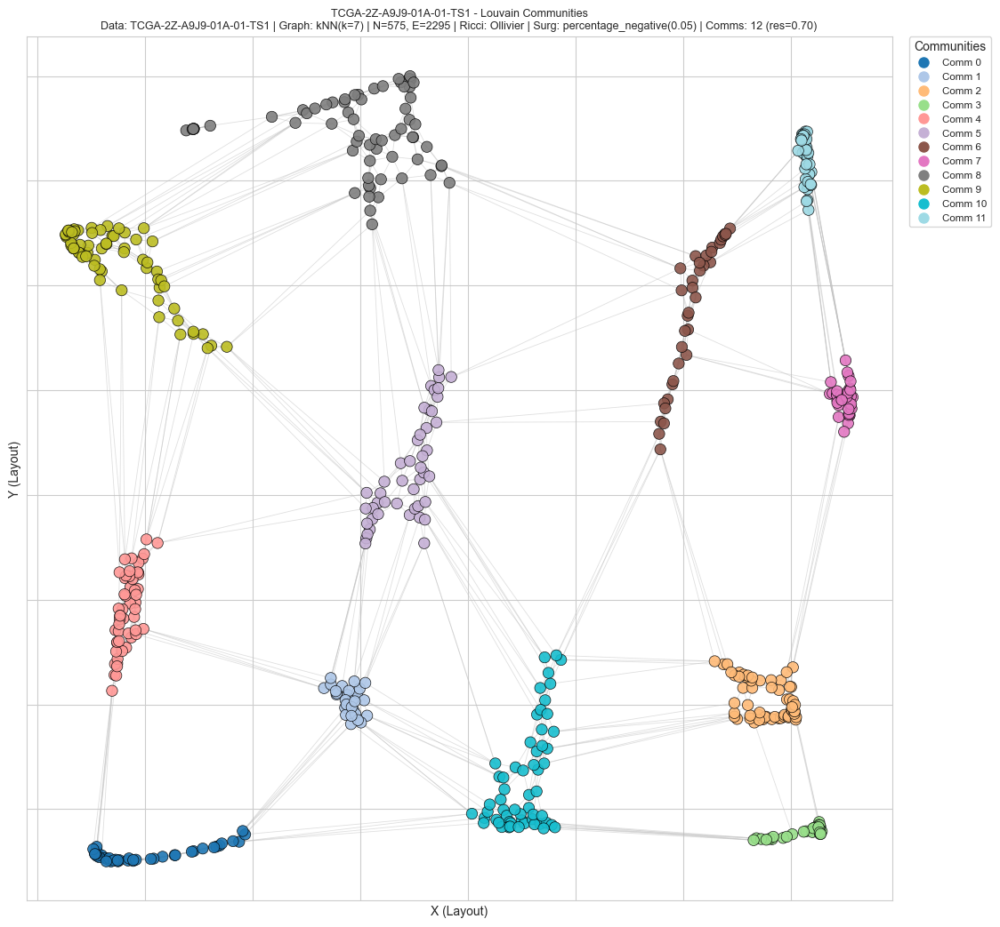

# GraphCurvature

## Pipeline Overview

This pipeline processes XML files containing 2D point data to build and analyze graphs. For each XML file, it:

1. Extracts centroids from the XML.
2. Builds an initial graph using k-Nearest Neighbors (kNN) or Delaunay triangulation.
3. Computes Ricci curvature on graph edges.
4. Optionally performs graph surgery by removing edges based on curvature thresholds.
5. Applies Louvain community detection at multiple resolutions.
6. Visualizes and optionally saves graphs, curvature distributions, and community layouts.

This workflow enables geometric and community structure analysis of spatial data with configurable parameters.

## Initial Graph with Ricci Curvature

## Louvain Communities Detected

